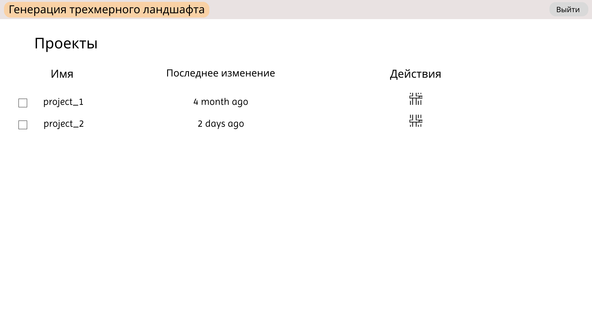
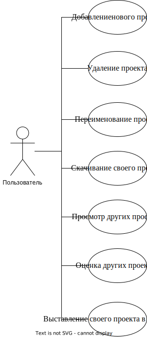
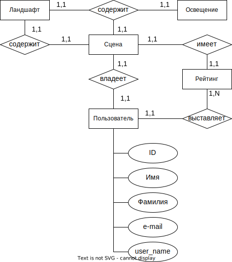

# Генерация трехмерного ландшафта методом шума Перлина

## Цель работы
Разработать WEB-сайт, выполняющий генерацию и визуализацию сцены,
представляющей трехмерный ландшафт. В основу генерации положить шум Перлина.

## Перечень функциональных требований
* визуализировать сцену, предоставляющую трехмерный ландшафт;
* предоставить пользователю возможность изменять настройки метода генерации сцены;
* предоставить возможность создания нескольких проектов ландшафта, а также изменение, удаление, поиск;
* предоставить пользователю возможность регистрации в системе;
* обеспечить вход в систему зарегистрированных пользователей;

## Черновые эскизы экранов приложения

Развернуть

## Use-case диаграмма системы

Развернуть

## Moodboard
Ссылка на [moodboard](https://pin.it/4Ye0ixK).

Целевая аудитория: пользователи, интересующиеся созданием трехмерных ландшафтов для бизнес-идей или игровой индустрии.

Портреты пользователей:

1. Антон, 30 лет. Работает в рекламной сфере. Хочет сформировать картинку, непохожую на остальные из интернета, для размещения эскиза работы.

2. Алина, 25 лет. Рассматривает интересующие идеи, ставит рейтинги.

Сценарий Антона:
 - Заходит на сайт и проходит регистрацию.
 - Создает проект.
 - Выставляет параметры генерации ландшафта.
 - Получает сформированное изображение.
 - Скачивает полученную картинку.
 - Использует ее в своем проекте.
 
 Сценарий Алины:
  - Заходит на сайт и авторизуется.
  - Выставляет свой проект на выставку.
  - Просматривает другие проекты пользователей.
  - Оценивает их.