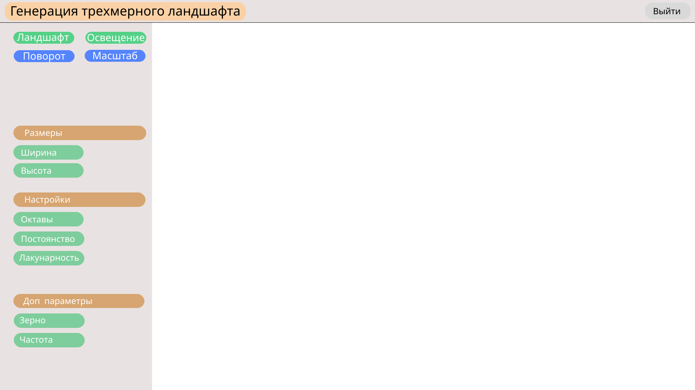
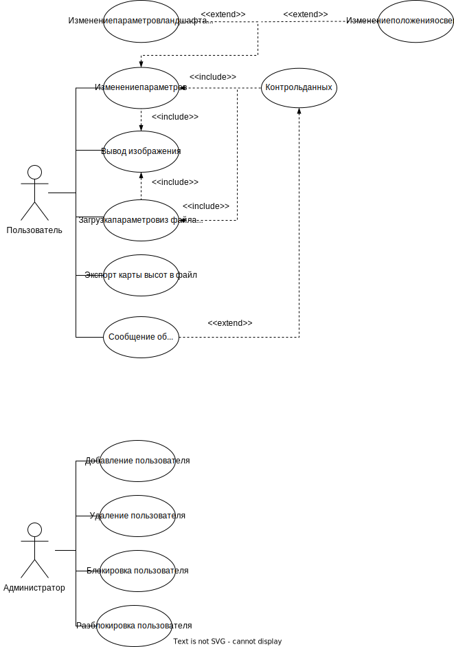

# Генерация трехмерного ландшафта методом шума Перлина

## Цель работы
Разработать WEB-сайта, выполняющее генерацию и визуализацию сцены,
представляющей трехмерный ландшафт. В основу генерации положить шум Перлина.

## Перечень функциональных требований
* визуализировать сцену, предоставляющую трехмерный ландшафт;
* предоставить пользователю в интефейсе ПО возможность изменять настройки метода генерации сцены;
* предоставить возможность создания нескольких проектов ландшафта, а также изменение, удаление, поиск;
* предоставить пользователю возможность регистрации в системе;
* обеспечить вход в систему зарегистрированных пользователей;

## Черновые эскизы экранов приложения

Развернуть

## Use-case диаграмма системы

Развернуть

